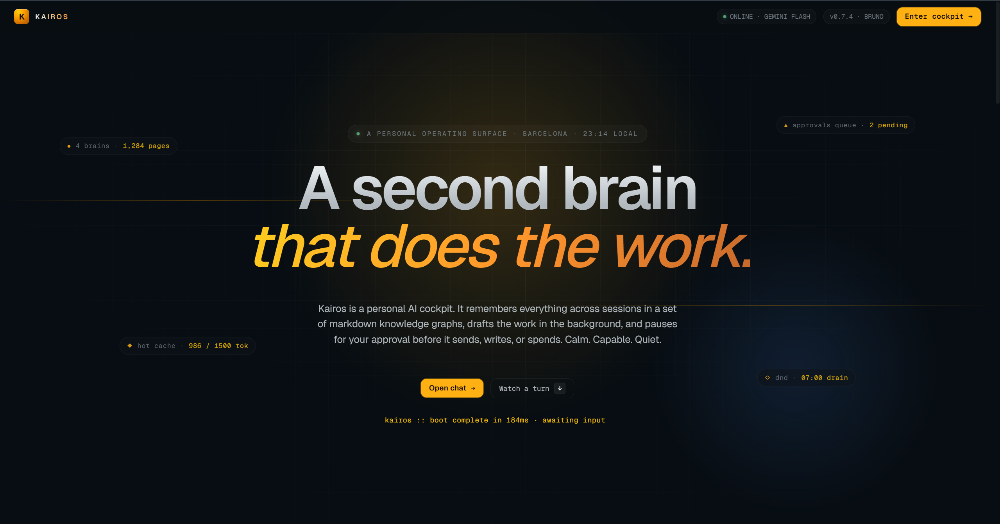

<div align="center">

# Kairos

**Your personal AI cockpit.**
Remembers everything. Drafts the work. Never touches production without asking.



[](https://www.python.org/)
[](https://www.typescriptlang.org/)
[](https://react.dev/)
[](https://vitejs.dev/)
[](https://fastapi.tiangolo.com/)
[](https://www.langchain.com/)
[](https://www.langchain.com/langgraph)
[](https://www.sqlite.org/)
[](https://deepmind.google/technologies/gemini/)
[](https://ollama.com/)
[](#status)
[](#license)

</div>

---

## What Kairos is

A long-running personal AI for a single user. Cloud LLM by default (Gemini Flash), local fallback (Ollama / Gemma). All long-term memory lives as plain markdown in a set of knowledge graphs — **brains** — that you own on disk. Every mutating tool the agent wants to call is paused at an **approval gate** you control from the web UI, the CLI, or a camera gesture.

It is **not a chatbot**. It is closer to a chief of staff: calm, capable, transparent, persistent across sessions.

### Why it exists

- **Memory that compounds.** Notes, summaries, and daily context live in `vault/<brain>/` as markdown — portable, diffable, editable by hand.
- **A graph, not a corpus.** Wikilinks (`[[slug]]`) stitch pages into a navigable map. The same graph drives the cockpit's force-directed view.
- **Approval-gated by default.** Any tool that sends, writes, or spends pauses for you. Nothing slips through.
- **Local-first where it matters.** Memory runs locally with no secrets. Only the harness holds API keys.
- **One user, one surface.** No login, no multi-tenant plumbing, no marketing pages.

---

## Table of contents

- [Architecture](#architecture)
- [Repo layout](#repo-layout)
- [Quickstart](#quickstart)
- [The cockpit](#the-cockpit)
- [CLI](#cli)
- [How approvals work](#how-approvals-work)
- [Brains & the vault](#brains--the-vault)
- [Dev notes](#dev-notes)
- [Status](#status)
- [Docs](#docs)
- [License](#license)

---

## Architecture

Three processes, one job each. The split is deliberate: each can be restarted without the others.

| Service   | Port | Role |
|-----------|:----:|------|
| `memory`  | 8001 | **State.** FastAPI over the markdown vault — pages, wikilink graph, FTS5 search, lint, ingest/solve planner. No LLM, no secrets. |
| `harness` | 8002 | **Behavior.** LangChain 1.x + Deep Agents runtime, streaming chat (SSE), `HumanInTheLoopMiddleware` approval gate, SQLite approval queue, audit log. |
| `web`     | 5173 | **Surface.** Vite + React 19 + TypeScript cockpit. |

```
┌──────────────┐      ┌──────────────┐      ┌──────────────┐
│     web      │────▶│   harness    │────▶│    memory    │
│ React cockpit │      │  deep agent  │      │   vault I/O  │
│  :5173        │◀────│  approvals   │◀────│  fts · graph │
└──────────────┘      │  :8002       │      │  :8001       │
                      └──────────────┘      └──────────────┘
                             │
                             ▼
                    ┌──────────────┐
                    │  Gemini API  │
                    │   (Ollama    │
                    │    fallback) │
                    └──────────────┘
```

---

## Repo layout

```
Personal AI/
├── apps/
│   └── web/                      Vite + React + TS cockpit (the UI)
├── docs/                         Research + architecture notes (00 → 11)
├── identity/                     SOUL.md · USER.md · HEARTBEAT.md
├── logs/                         Runtime logs (audit.jsonl etc.)
├── policies/                     actions.yaml · network.yaml · secrets.env(.example)
├── scripts/                      run.py (used by run.ps1) + onboarding
├── services/
│   ├── channels/
│   │   ├── cli/                  `kairos` typer CLI
│   │   └── web/                  (reserved for future web-channel glue)
│   ├── harness/                  Deep Agent, approval queue, REST shim (port 8002)
│   ├── memory/                   Markdown vault, graph, FTS, lint (port 8001)
│   ├── perception/               Voice + gesture input (Phase 3+)
│   └── runtime/                  Shared LLM client config
├── vault/                        Your brains live here — each is a folder of markdown
├── run.ps1                       Start all three services (colored logs, one Ctrl+C)
└── stop.ps1                      Kill anything lingering on the service ports
```

> Python packages are `kairos_memory`, `kairos_harness`, `kairos_cli`, `kairos_runtime`. The CLI command is `kairos`.

---

## Quickstart

**Prerequisites:** Python **3.11+**, Node **18+**, optional [`uv`](https://github.com/astral-sh/uv).

```powershell
# 1. Python env + deps
python -m venv .venv
.\.venv\Scripts\Activate.ps1
pip install -e ".[dev]"
# …or, if you have uv:   uv sync

# 2. Configure secrets (edit the copy, not the example)
copy policies\secrets.env.example policies\secrets.env
# Set GOOGLE_API_KEY (required). TAVILY_API_KEY is optional.

# 3. Launch everything in one terminal
.\run.ps1

# 4. Open the cockpit
# → http://localhost:5173
```

`run.ps1` streams `memory`, `harness`, and `web` logs side by side with a colored prefix per service. `Ctrl+C` once shuts all three down cleanly.

If a prior run left a zombie process on a port:

```powershell
.\stop.ps1     # frees 8001, 8002, 5173, 5174
```

---

## The cockpit

Five routes under `/app/*`:

| Route          | What it's for |
|----------------|---------------|
| **Chat**       | Streamed conversation with live tool callouts, inline ingest-plan diffs, wikilink navigation. |
| **Graph**      | Force-directed view of the active brain. Click a node → tilted flashcard with a preview and an "Open page" button. |
| **Approvals**  | Every mutating tool call the agent has paused on. Approve / deny from keyboard, CLI, or camera gesture. |
| **Brains**     | Browse a brain — sidebar of pages (hot · index · wiki · raw), rendered markdown, lint report. |
| **Settings**   | Gesture recognition knobs (fps, confidence, confirm frames, cooldown). Persisted to `localStorage`. |

Data contracts live in [`apps/web/src/lib/api.ts`](apps/web/src/lib/api.ts).

---

## CLI

One-shot commands. The CLI spawns, talks to the harness over HTTP, and exits.

```powershell
kairos status                     # health of both services + pending approvals
kairos brains                     # list brains, mark the active one
kairos switch "Bruno's Brain"     # change active brain (starts a new thread)
kairos ask "Summarize hot.md"     # send a message, print the answer
kairos approvals list             # see queued approvals (--status pending|all|…)
kairos approvals approve <id>     # 8-char prefix is fine
kairos approvals deny <id> -f "reason"
```

---

## How approvals work

Tools listed under `require_approval` in [`policies/actions.yaml`](policies/actions.yaml) are intercepted by `HumanInTheLoopMiddleware`. The agent pauses via a LangGraph `interrupt`, the request is persisted to `services/harness/data/approvals.db`, and every channel (web, CLI, gesture) sees the same queue. On approve/deny, the agent resumes with `Command(resume=...)`.

- Default in-session timeout: **5 minutes**. Expired items are never executed.
- **DND** window (01:00–07:00 Europe/Madrid): requests land as `dnd_held` and drain to `pending` at the 07:00 heartbeat.
- Queue is persisted across process restarts.
- Every tool call is also appended to [`logs/audit.jsonl`](logs/).

---

## Brains & the vault

A brain is a folder under `vault/`:

```
vault/<brain>/
├── AGENTS.md       Schema + rules the wiki agent follows
├── hot.md          Loaded into every prompt (working set, ~500 tokens)
├── index.md        TOC over all wiki pages
├── log.md          Append-only operation log
├── raw/            Immutable captures (never modified by the agent)
└── wiki/
    ├── overview.md
    ├── sources/
    ├── entities/
    ├── concepts/
    └── analyses/
```

Markdown is the source of truth. SQLite FTS5 at `services/memory/data/fts.sqlite` is rebuilt from disk on demand. Wikilinks (`[[slug]]`) power the graph view and the cockpit's navigation between pages. Read a brain's `AGENTS.md` before writing to the vault by hand — that's the contract the wiki agent follows.

---

## Dev notes

```powershell
# Frontend type check (from apps/web)
cd apps\web
npx tsc --noEmit

# Python lint + type check + tests (from repo root)
ruff check .
mypy services
pytest
```

Where things live:

| What               | Where |
|--------------------|-------|
| Runtime logs       | `logs/` |
| FTS index          | `services/memory/data/fts.sqlite` |
| Approvals DB       | `services/harness/data/approvals.db` |
| Thread checkpoints | LangGraph SQLite checkpointer (harness data dir) |

---

## Status

**Phase 1 — active.** Working today:

- Streaming chat with live tool telemetry.
- Full approvals flow (web + CLI channels, SQLite queue).
- Markdown brains with render + wikilink navigation.
- Force-directed graph with click-to-peek 3D flashcard.
- Lint + solve cycle (plan → approve → apply).
- Gesture-ready settings panel.
- Typer-based CLI.

**Next:** voice input, camera-gesture approvals wired end to end, Telegram channel. See [`docs/07-roadmap.md`](docs/07-roadmap.md).

---

## Docs

Read in order:

1. [`docs/00-overview.md`](docs/00-overview.md) — north-star goal and the four pillars.
2. [`docs/06-jarvis-architecture-proposal.md`](docs/06-jarvis-architecture-proposal.md) — composition and rationale.
3. [`docs/09-locked-decisions.md`](docs/09-locked-decisions.md) — what's fixed vs. still open.
4. [`docs/11-hot-cache.md`](docs/11-hot-cache.md) — why `hot.md` is first-class.

---

## License

Proprietary — private project. Not for redistribution.
